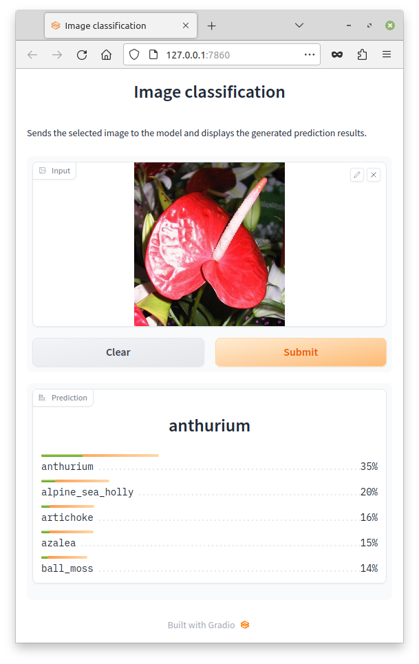
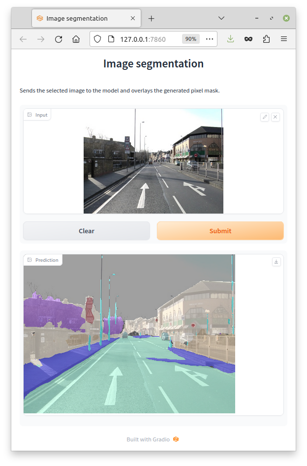
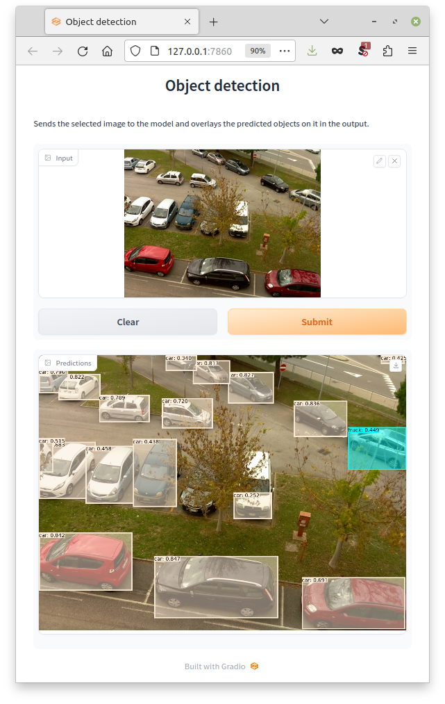
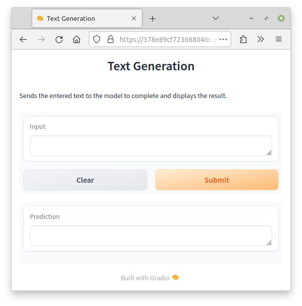

# gifr
[gradio](https://www.gradio.app/) interfaces for Deep Learning Docker images 
that use Redis for receiving data to make predictions on.

https://www.data-mining.co.nz/docker-images/


## Installation

```bash
pip install git+https://github.com/waikato-datamining/gifr.git
```


## Tutorials

Here are tutorials for a range of Docker images:

* [Image classification](https://www.data-mining.co.nz/applied-deep-learning/image_classification/)
* [Image segmentation](https://www.data-mining.co.nz/applied-deep-learning/image_segmentation/)
* [Instance segmentation](https://www.data-mining.co.nz/applied-deep-learning/instance_segmentation/) (can use Object detection interface as well)  
* [Object detection](https://www.data-mining.co.nz/applied-deep-learning/object_detection/)


## Interfaces

### Image classification



```
usage: gifr-imgcls [-h] [--redis_host HOST] [--redis_port PORT]
                   [--redis_db DB] [--model_channel_in CHANNEL]
                   [--model_channel_out CHANNEL] [--timeout SECONDS]
                   [--launch_browser] [--share_interface]
                   [--logging_level {DEBUG,INFO,WARN,ERROR,CRITICAL}]

Image classification interface. Allows the user to select an image and display
the probabilities per label that the model generated.

optional arguments:
  -h, --help            show this help message and exit
  --redis_host HOST     The host with the redis server. (default: localhost)
  --redis_port PORT     The port of the redis server. (default: 6379)
  --redis_db DB         The redis database to use. (default: 0)
  --model_channel_in CHANNEL
                        The channel to send the data to for making
                        predictions. (default: images)
  --model_channel_out CHANNEL
                        The channel to receive the predictions on. (default:
                        predictions)
  --timeout SECONDS     The number of seconds to wait for a prediction.
                        (default: 1.0)
  --launch_browser      Whether to automatically launch the interface in a new
                        tab of the default browser. (default: False)
  --share_interface     Whether to publicly share the interface at
                        https://XYZ.gradio.live/. (default: False)
  --logging_level {DEBUG,INFO,WARN,ERROR,CRITICAL}
                        The logging level to use (default: WARN)
```


### Image segmentation



```
usage: gifr-imgseg [-h] [--redis_host HOST] [--redis_port PORT]
                   [--redis_db DB] [--model_channel_in CHANNEL]
                   [--model_channel_out CHANNEL] [--timeout SECONDS]
                   [--launch_browser] [--share_interface]
                   [--logging_level {DEBUG,INFO,WARN,ERROR,CRITICAL}]
                   [--prediction_type {auto,blue-channel,grayscale,indexed-png}]
                   [--alpha NUM] [--only_mask]

Image segmentation interface. Allows the user to select an image and display
the generated pixel mask overlayed.

optional arguments:
  -h, --help            show this help message and exit
  --redis_host HOST     The host with the redis server. (default: localhost)
  --redis_port PORT     The port of the redis server. (default: 6379)
  --redis_db DB         The redis database to use. (default: 0)
  --model_channel_in CHANNEL
                        The channel to send the data to for making
                        predictions. (default: images)
  --model_channel_out CHANNEL
                        The channel to receive the predictions on. (default:
                        predictions)
  --timeout SECONDS     The number of seconds to wait for a prediction.
                        (default: 2.0)
  --launch_browser      Whether to automatically launch the interface in a new
                        tab of the default browser. (default: False)
  --share_interface     Whether to publicly share the interface at
                        https://XYZ.gradio.live/. (default: False)
  --logging_level {DEBUG,INFO,WARN,ERROR,CRITICAL}
                        The logging level to use (default: WARN)
  --prediction_type {auto,blue-channel,grayscale,indexed-png}
                        The type of image that the model returns (default:
                        auto)
  --alpha NUM           The alpha value to use for the overlay (0:
                        transparent, 255: opaque). (default: 128)
  --only_mask           Whether to show only the predicted mask rather than
                        overlaying it. (default: False)
```


### Object detection/Instance segmentation



```
usage: gifr-objdet [-h] [--redis_host HOST] [--redis_port PORT]
                   [--redis_db DB] [--model_channel_in CHANNEL]
                   [--model_channel_out CHANNEL] [--timeout SECONDS]
                   [--launch_browser] [--share_interface]
                   [--logging_level {DEBUG,INFO,WARN,ERROR,CRITICAL}]
                   [--min_score FLOAT] [--text_format FORMAT]
                   [--text_placement V,H] [--font_family NAME]
                   [--font_size SIZE] [--num_decimals NUM]
                   [--outline_thickness NUM] [--outline_alpha NUM] [--fill]
                   [--fill_alpha NUM] [--vary_colors] [--force_bbox]

Object detection interface. Allows the user to select an image and overlay the
predictions that the model generated.

optional arguments:
  -h, --help            show this help message and exit
  --redis_host HOST     The host with the redis server. (default: localhost)
  --redis_port PORT     The port of the redis server. (default: 6379)
  --redis_db DB         The redis database to use. (default: 0)
  --model_channel_in CHANNEL
                        The channel to send the data to for making
                        predictions. (default: images)
  --model_channel_out CHANNEL
                        The channel to receive the predictions on. (default:
                        predictions)
  --timeout SECONDS     The number of seconds to wait for a prediction.
                        (default: 1.0)
  --launch_browser      Whether to automatically launch the interface in a new
                        tab of the default browser. (default: False)
  --share_interface     Whether to publicly share the interface at
                        https://XYZ.gradio.live/. (default: False)
  --logging_level {DEBUG,INFO,WARN,ERROR,CRITICAL}
                        The logging level to use (default: WARN)
  --min_score FLOAT     The minimum score a prediction must have (0-1).
                        (default: 0.0)
  --text_format FORMAT  The format for the text, placeholders: {label},
                        {score}. (default: {label})
  --text_placement V,H  Comma-separated list of vertical (T=top, C=center,
                        B=bottom) and horizontal (L=left, C=center, R=right)
                        anchoring. (default: T,L)
  --font_family NAME    The name of the font family. (default: sans\-serif)
  --font_size SIZE      The size of the font. (default: 14)
  --num_decimals NUM    The number of decimals to use for the score. (default:
                        3)
  --outline_thickness NUM
                        The line thickness to use for the outline, <1 to turn
                        off. (default: 3)
  --outline_alpha NUM   The alpha value to use for the outline (0:
                        transparent, 255: opaque). (default: 255)
  --fill                Whether to fill the bounding boxes/polygons (default:
                        False)
  --fill_alpha NUM      The alpha value to use for the filling (0:
                        transparent, 255: opaque). (default: 128)
  --vary_colors         Whether to vary the colors of the outline/filling
                        regardless of label (default: False)
  --force_bbox          Whether to force a bounding box even if there is a
                        polygon available (default: False)
```

### Text generation



```
usage: gifr-textgen [-h] [--redis_host HOST] [--redis_port PORT]
                    [--redis_db DB] [--model_channel_in CHANNEL]
                    [--model_channel_out CHANNEL] [--timeout SECONDS]
                    [--launch_browser] [--share_interface]
                    [--logging_level {DEBUG,INFO,WARN,ERROR,CRITICAL}]

Text generation interface. Allows the user to enter text and display the text
generated by the model.

optional arguments:
  -h, --help            show this help message and exit
  --redis_host HOST     The host with the redis server. (default: localhost)
  --redis_port PORT     The port of the redis server. (default: 6379)
  --redis_db DB         The redis database to use. (default: 0)
  --model_channel_in CHANNEL
                        The channel to send the data to for making
                        predictions. (default: text)
  --model_channel_out CHANNEL
                        The channel to receive the predictions on. (default:
                        prediction)
  --timeout SECONDS     The number of seconds to wait for a prediction.
                        (default: 1.0)
  --launch_browser      Whether to automatically launch the interface in a new
                        tab of the default browser. (default: False)
  --share_interface     Whether to publicly share the interface at
                        https://XYZ.gradio.live/. (default: False)
  --logging_level {DEBUG,INFO,WARN,ERROR,CRITICAL}
                        The logging level to use (default: WARN)
```
